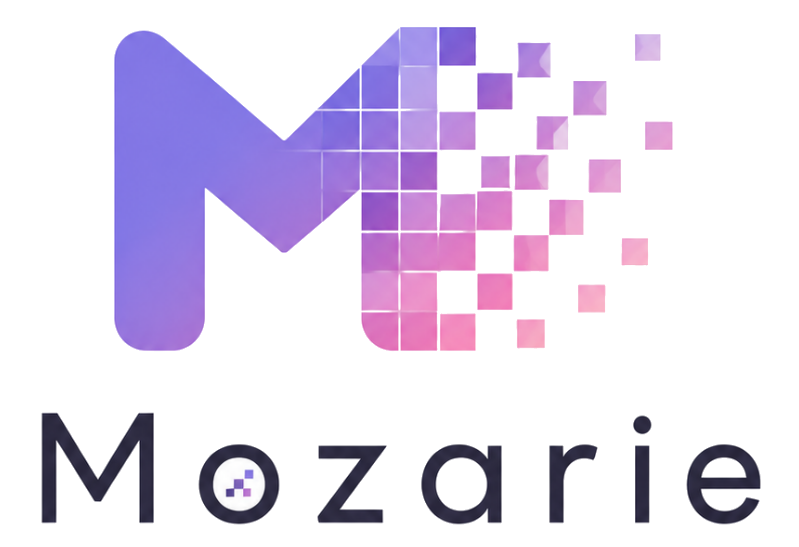

<p align="center"></p>

[English](README.en.md) · [最新版](https://github.com/norqis/mozarie/releases/latest) · [不具合を報告](https://github.com/norqis/mozarie/issues)

Mozarieは、画像のモザイク範囲をローカルで検出・確認・修正して保存できるWindowsアプリです。候補の採用、除外、手書き修正、保存先はすべて自分で決められます。

## 主な機能

- PNG、JPEG、WebPの画像・フォルダーを読み込み、現在の画像または全画像を自動検出
- 検出候補を表示・除外・削除し、モザイク／除外ブラシ、消しゴム、境界ツールで修正
- 手の領域を除外し、候補ごとの強制除外でモザイクより優先
- 現在画像、モザイクあり、確認済みから選んでコピー保存または元画像へ上書き

## インストール

### 動作環境

- Windows
- Python 3.11以降

### セットアップ

```powershell
python -m pip install -r requirements.txt
```

### 起動

```powershell
.\run.bat
```

初回起動後、**設定 > 検出**で基本モデルを指定します。

## モデル

### アプリからダウンロード

設定 > 検出で、使う項目の**ダウンロード**を押します。SAMは選択中の種類だけを取得します。

| 用途 | ファイル | 配布元 |
| --- | --- | --- |
| 輪郭補正・境界ツール・手の除外 | <ul><li><code>sam_vit_b_01ec64.pth</code></li><li><code>sam_vit_l_0b3195.pth</code></li><li><code>sam_vit_h_4b8939.pth</code></li></ul> | [Meta Segment Anything](https://github.com/facebookresearch/segment-anything#model-checkpoints) |
| アニメ調の手検出 | `anime-hand-v1.0-s.onnx` | [anime_hand_detection](https://huggingface.co/deepghs/anime_hand_detection/tree/dba2c5bec15fcee9ac4909b244a84e8783cf46a2) |
| 手の輪郭補正 | `handsegnet_vit_b_best.safetensors` | [HandSegNet anime SDXL](https://huggingface.co/Ov3rLoRd-MLEngineer/handsegnet-anime-sdxl/tree/77ff734683306141e56aef9d491958a82508b41a) |

### 自分で用意するモデル

| 用途 | 用意するもの | 配布元・指定方法 |
| --- | --- | --- |
| 基本の性器検出 | `nsfw-anime-xl-x1280.onnx` | [固定配布元](https://huggingface.co/01miku/anime-nsfw-segm-yolo26/blob/1697d5d1827b6a818b350b44bf3ec27f08837a2a/nsfw-anime-xl-x1280.onnx)（[直接ダウンロード](https://huggingface.co/01miku/anime-nsfw-segm-yolo26/resolve/1697d5d1827b6a818b350b44bf3ec27f08837a2a/nsfw-anime-xl-x1280.onnx)）からそのまま取得し、**参照**から指定します。変換は不要です。126,350,117 bytes（120.5 MiB）、SHA-256: `92046f77852b3e3d3a3ddf74575dd9d11f79f832af8d2d3e7eac186ba379194a`。 |
| NTD11補助検出 | `animeNSFWDetection_v50Variant1.zip`内の`ntd11_anime_nsfw_segm_v5-variant1.pt`を変換したONNX | [Anime NSFW Detection / ADetailer All-in-One v5.0-variant1](https://civitai.red/models/1313556?modelVersionId=2350456)のv5.0-variant1 ZIPを取得・展開し、この`.pt`を変換して、生成したONNXを**参照**から指定します。 |
| Sensitive補助検出 | `sensitive_detect_v07.pt`を変換したONNX | [Sensitive v07](https://huggingface.co/sugarknight/sensitive-detect/tree/b7ec7a528841aac3d52411fb4d031d51a8225e40)から取得し、変換後のONNXを**参照**から指定します。 |

NTD11の変換:

```powershell
python -m pip install "ultralytics==8.4.75"
yolo export model="ダウンロードしたntd11_anime_nsfw_segm_v5-variant1.ptのパス" format=onnx imgsz=1024 batch=1 dynamic=False simplify=False opset=17 nms=False end2end=False device=cpu
```

Sensitiveの変換:

```powershell
python -m pip install "ultralytics==8.4.75"
yolo export model="ダウンロードしたsensitive_detect_v07.ptのパス" format=onnx imgsz=1024 batch=1 dynamic=False simplify=False opset=17 nms=False end2end=False device=cpu
```

変換すると同じフォルダーに同名の`.onnx`が生成されます。設定でそのONNXを指定し、モデルの状態が有効であることを確認してから検出を実行してください。

モデルの配布条件・ライセンスは、各配布元と[第三者ライセンス・モデル配布元](THIRD_PARTY_NOTICES.md)を確認してください。

## 使い方

1. 画像またはフォルダーを読み込みます。
2. 現在の画像または全画像に自動検出を実行します。
3. 右側の候補を確認し、必要に応じてブラシ、消しゴム、境界ツールで修正します。
4. 保存対象を選び、コピー保存または元画像への上書きを行います。

GPU処理を使う場合は、**設定 > 検出**でGPUを選びます。GPUメモリが不足した場合は、同時処理数を下げるかCPUへ切り替えてください。

## 更新

設定の**更新を確認**、または`update.bat`を使います。適用前にMozarieを終了してください。設定、モデル、作業中の画像は更新しても残ります。

## 困ったとき

- **モデルを読み込めない:** ファイル形式と、SAMの種類・ファイルの組み合わせを確認してください。
- **GPUまたはCUDAのエラー:** 同時処理数を下げる、別のGPUを選ぶ、またはCPUへ切り替えてください。
- **解決しない:** エラー文を添えて[Issues](https://github.com/norqis/mozarie/issues)へ報告してください。

## 開発

```powershell
python -m unittest discover -s tests -v
npm ci
npm test
```

## ライセンス

Mozarieは[MIT License](LICENSE)で公開しています。第三者コンポーネントとモデル配布元は[THIRD_PARTY_NOTICES.md](THIRD_PARTY_NOTICES.md)を確認してください。
